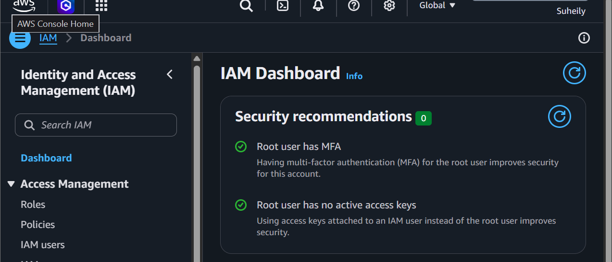
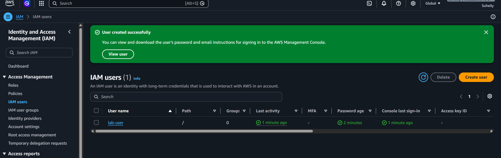
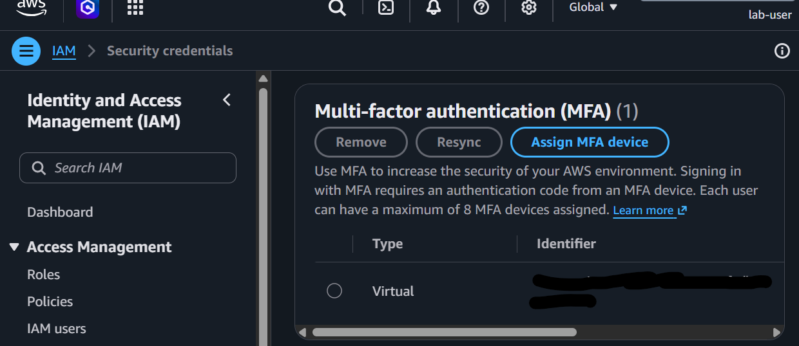
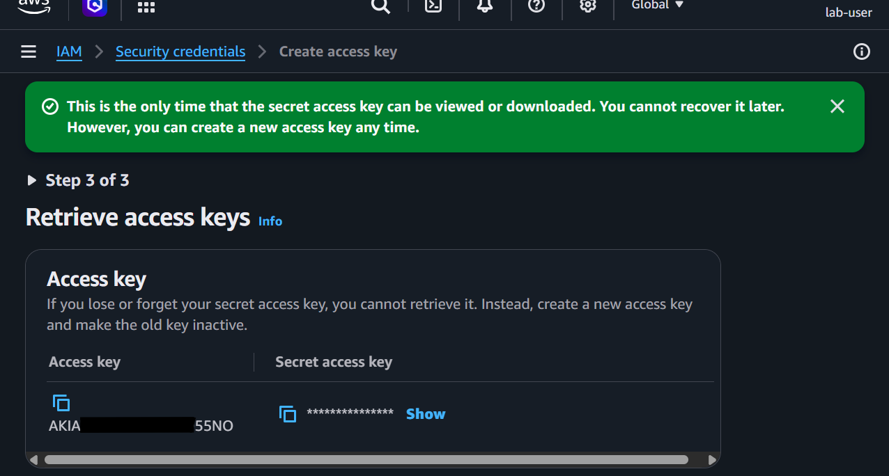

# Step 01 AWS Account Setup MFA

## Root User MFA Proof

## IAM Users List

## IAM User MFA Proof

## Access Keys Confirmation

## Why root user MFA and least-privelege IAM users matter for cloud security

The root user MFA matters for cloud security because it makes sure the account is fully protected and adds an extra layer security. If the password were to ever get exposed, then anyone can get into the account, but with MFA only the person who has the MFA device can sign in. It's also important to have hte IAM user set up with least-privelege permissions because it lowers the chances of any mistakes. Since their permissions are limited, they can't accidentally do something major like deleting important resources.