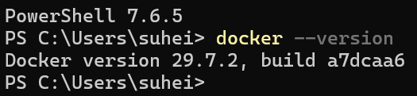
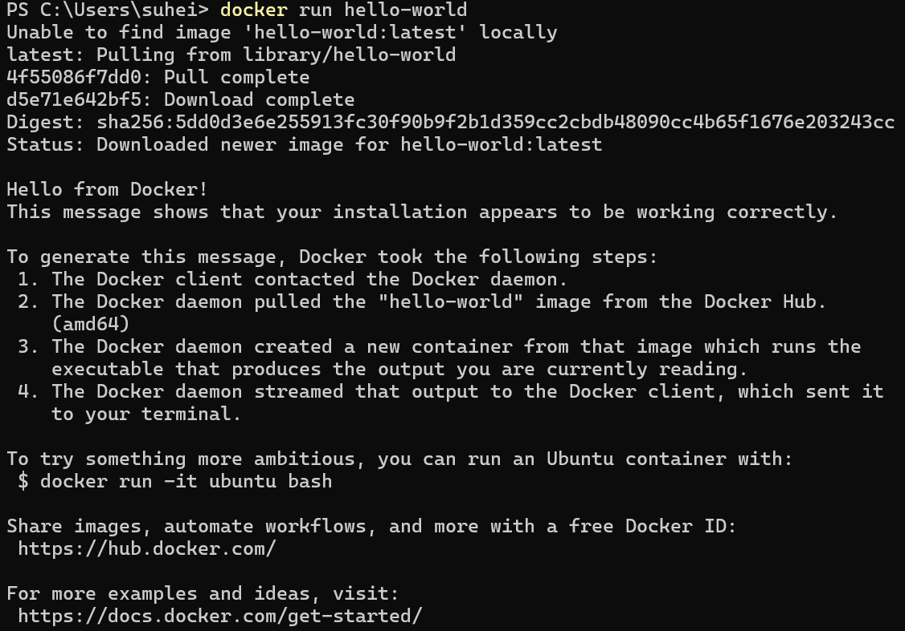
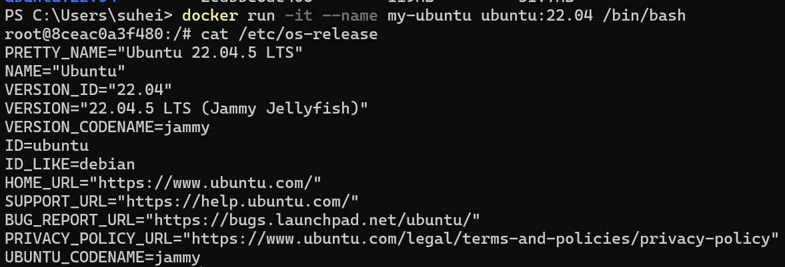
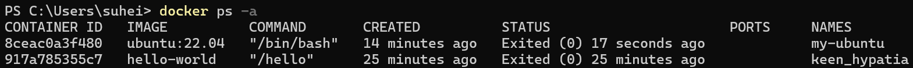
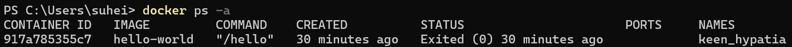

# Step 02 Docker Linux Container Setup

## Docker Version

## Hello World Output

## Cat /etc/os-release

## docker ps -a before

## docker ps -a after

## The difference between a Docker image and a Docker container.

The difference between a Docker image and a Docker container is the image is a read only template, while the container is the instance created from the image. The Docker image has the application code and everything needed to setup the environment, and the container is what actually runs and where you can run all of the commands. One way that I like to think about it is as a recipe and a cooked meal. The Docker image is the recipe that never changes, and the container is the meal you are able to make from it. You are able to use it, change it, and at the end of the day you can throw it away once done. 