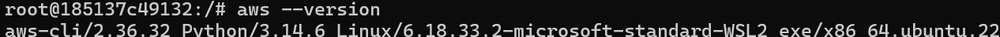
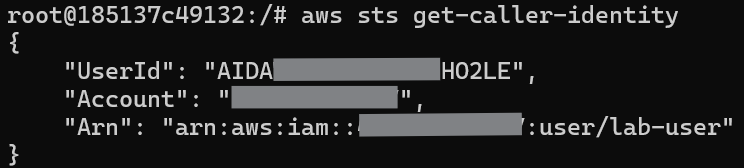
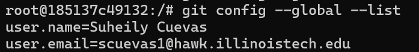
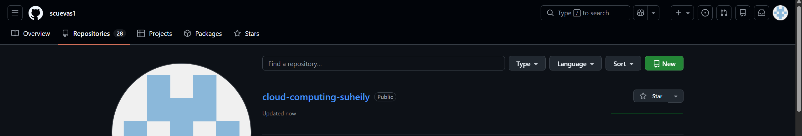

# Step 03 AWS CLI GitHub Container Setup

## AWS Version

## AWS get caller Identity

## Name and Email

## Github Proof

## Why you should never commit AWS credentials or GitHub tokens to a repository.

You should never commit any AWS credentials or GitHub tokens to a repository because those credentials give full access to the accounts and resources. If your AWS credentials were to get exposed, an attacker could delete data, access sensitive information, and change any services. As for GitHub tokens, those should always remain private because an attacker can easily delete or edit any code and they can access sensitive data. It is always a safer option to keep all of these credentials stored securely in like a password manager, connect two factor authentication, and change the passwords regularly. 