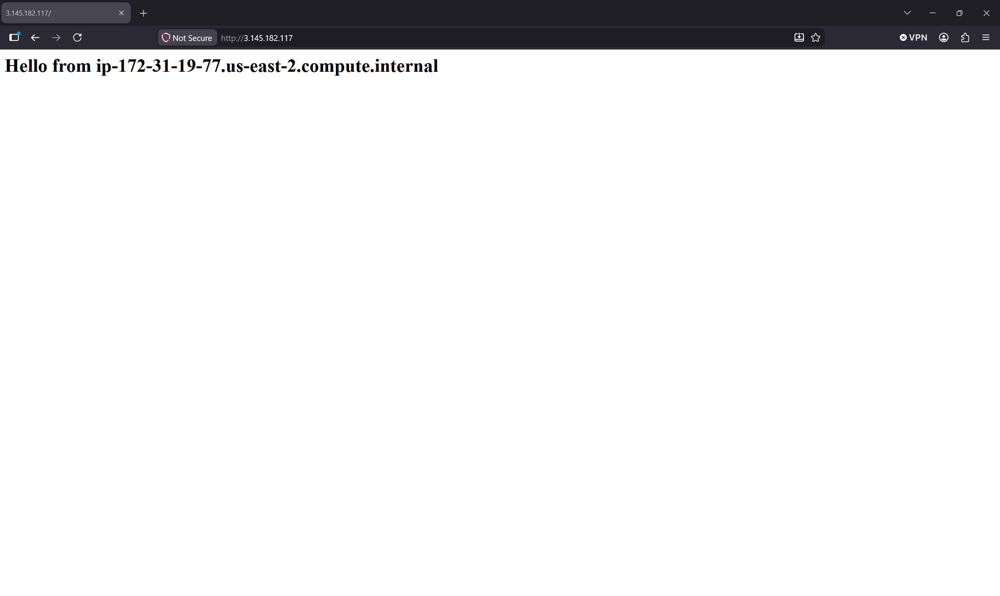
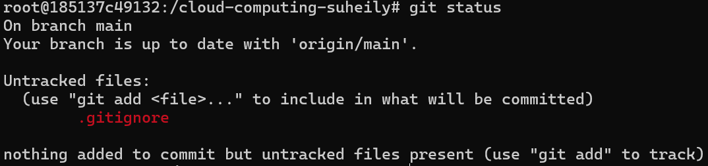
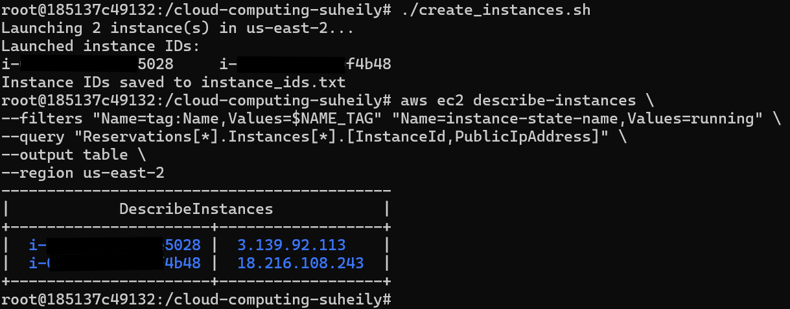
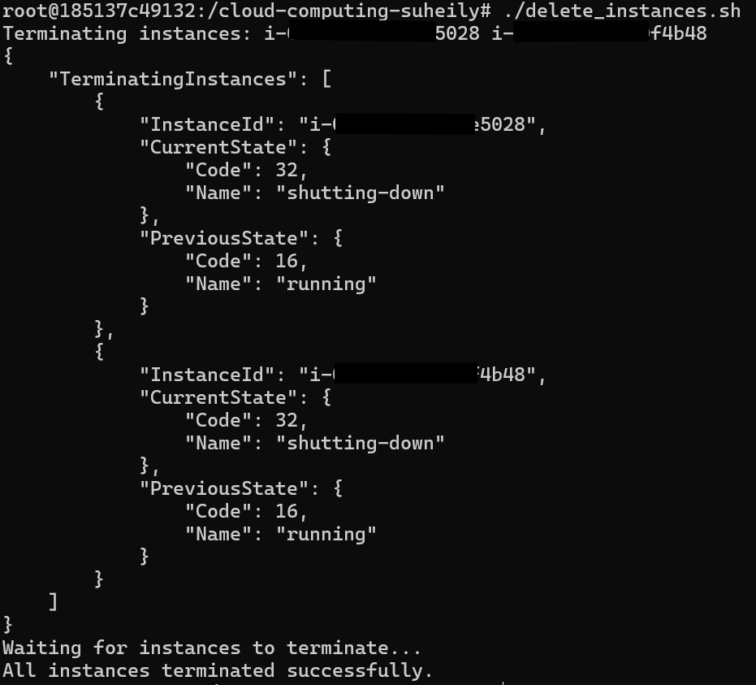

# AWS CLI EC2 EnvVariables

## aws ec2 describe-instances labeled

## Hello From Web page

## Git Status Output

## create_instances.sh Output

## delete_instances.sh Output

## Why are environment files excluded from Git, even in a “private” repository?
